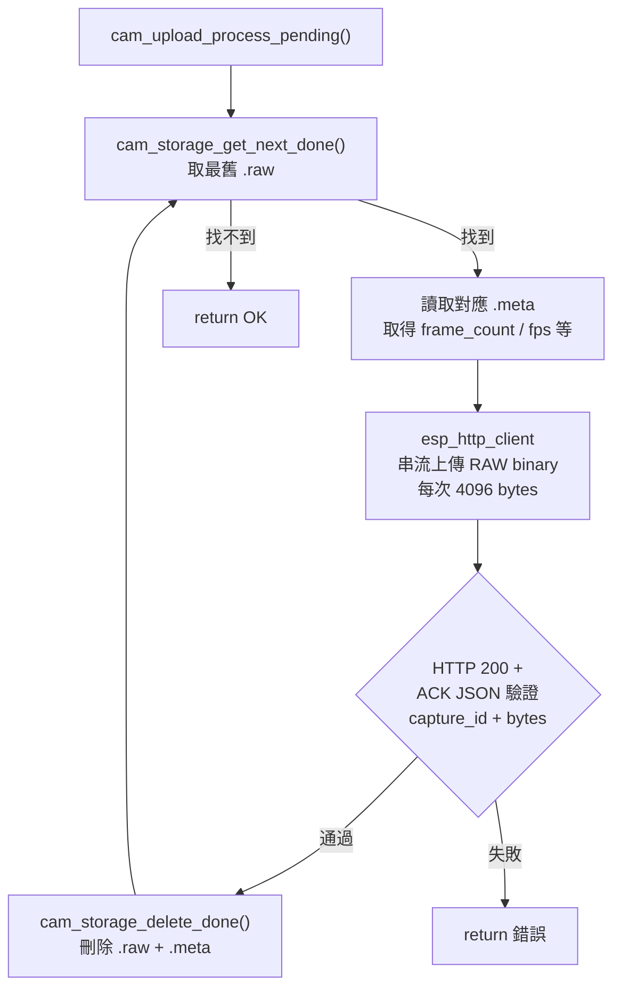
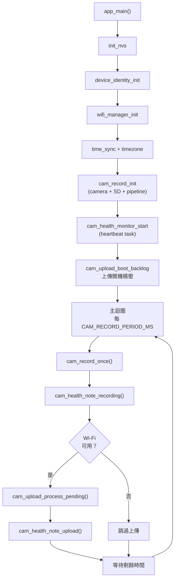
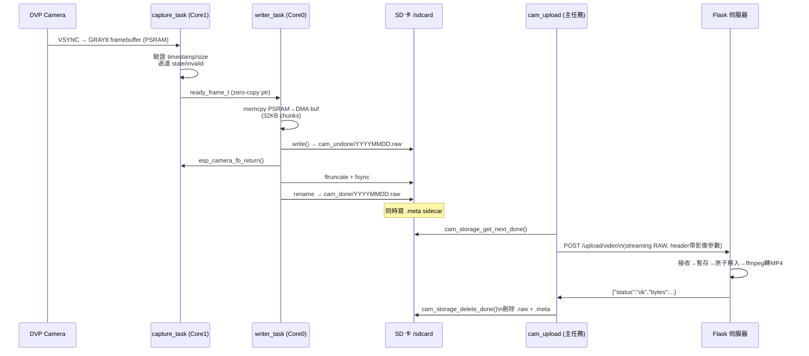

# Camera Node 架構設計規劃

## 一、目標概覽

將現有 `cam_record.c` 從「按鈕觸發 + 測試模式」改造為與音頻節點相同的
**自動排程 → 錄影 → 上傳 → Heartbeat** 全自動架構，
資料格式改為 **RAW（GRAY8）→ 伺服器端轉 MP4**。

---

## 二、現有 cam_record.c 與音頻架構的對應關係

| 音頻架構 | 相機架構（現有） | 差異點 |
|---|---|---|
| I2S DMA → int16_t PCM | DVP DMA → GRAY8 pixels | 資料源不同，都是 DMA |
| `capture_task` (Core1, P10) | `capture_task` (Core1, P6) | **優先度待提升** |
| `writer_task` (Core0, P6) | `writer_task` (Core0, P5) | 相近 |
| Queue of `audio_block_t*` | Queue of `ready_frame_t` (zero-copy) | 相機已做 zero-copy，無需額外 block pool |
| WAV header + `fwrite()` | RAW 預分配 + `write()` (fd) | 檔案格式不同，RAW 更簡單 |
| `storage.c` 管理 undone/done | **尚無** 等效 storage 管理 | **須新增** |
| `upload.c` HTTP POST WAV | **尚無** upload 邏輯 | **須新增** |
| `health.c` heartbeat | **尚無** heartbeat | **須新增** |
| `app_main.c` 排程主迴圈 | `app_main()` 跑按鈕觸發迴圈 | **須改造** |

> [!IMPORTANT]
> 現有 `cam_record.c` 的 `app_main()` 包含按鈕觸發、FPS 測試等開發用邏輯，整合時須抽離為獨立初始化函式，並移除按鈕依賴。

---

## 三、模組規劃

### 保留（大幅複用）
- `cam_record.c` 中的：`init_camera()`、`configure_sensor()`、`discard_warmup_frames()`、`capture_task`、`writer_task`、`write_frame_to_sd()`、`init_record_pipeline()`

### 新增 / 改造

```
cam_record.c（改造）    ← 新增公開 API，移除 app_main()
cam_storage.c（新增）   ← 相機版 storage，管理 undone/done RAW 檔案
cam_upload.c（新增）    ← 相機版 upload，HTTP POST RAW 到伺服器
cam_health.c（新增）    ← 相機 heartbeat 定時任務
app_main.c（整合）      ← 統一排程主迴圈（或另建 cam_app_main.c）
server.py（擴充）       ← 新增 /upload/video 端點，接收 RAW 轉 MP4
```

---

## 四、cam_record.c 改造 API

移除 `app_main()` 中的按鈕觸發邏輯，對外暴露以下介面：

```c
// cam_record.h

typedef struct {
    bool      success;
    uint32_t  saved_frames;
    uint32_t  dropped_frames;
    uint32_t  frame_gaps;
    int64_t   elapsed_ms;
    time_t    recorded_at_epoch;
    char      file_path[64];      // done/ 路徑（成功）或 undone/ 路徑（失敗）
    size_t    file_bytes;
    esp_err_t error;
} cam_record_result_t;

esp_err_t cam_record_init(void);      // 初始化 camera + SD + pipeline
esp_err_t cam_record_once(cam_record_result_t *result); // 錄一段影片
void      cam_record_deinit(void);
```

`cam_record_once()` 流程：
1. `cam_storage_begin_recording()` → 保留 `undone/` 路徑
2. `reset_record_queues()`
3. 計算 trigger_us / deadline_us（直接用 `esp_timer_get_time()`，不等按鈕）
4. 啟動 `writer_task` → 等待 ready → 啟動 `capture_task`
5. `xEventGroupWaitBits()` 等兩個任務完成
6. `cam_storage_finish_recording(ok/fail)` → rename 或保留

---

## 五、cam_storage.c 設計

與 `storage.c` 完全對稱，僅副檔名與路徑不同：

```
/sdcard/
├── cam_undone/        ← 錄影中 / 錄影失敗
│   └── 20260917_214900.raw
└── cam_done/          ← 錄影完成，等待上傳
    └── 20260917_214900.raw
```

**關鍵設計：RAW 檔頭 Sidecar**

RAW 是 pure binary，伺服器轉 MP4 需要知道影像參數。方案：

```
/sdcard/cam_done/
    20260917_214900.raw        ← GRAY8 raw frames (連續)
    20260917_214900.meta       ← JSON sidecar（寬、高、fps、幀數、時戳）
```

meta 內容範例：
```json
{
  "width": 640,
  "height": 480,
  "fps": 5,
  "frames": 50,
  "format": "GRAY8",
  "recorded_at": 1757854140,
  "device_id": "cam-node-01"
}
```

**API**：

```c
esp_err_t cam_storage_init(void);
esp_err_t cam_storage_begin_recording(cam_storage_recording_t *rec, time_t epoch);
esp_err_t cam_storage_finish_recording(cam_storage_recording_t *rec, bool commit,
                                        uint32_t saved_frames);
esp_err_t cam_storage_get_next_done(char *path, size_t path_size,
                                    time_t *recorded_at_epoch);
esp_err_t cam_storage_count_done(size_t *count_out);
esp_err_t cam_storage_delete_done(const char *raw_path); // 同時刪 .raw + .meta
esp_err_t cam_storage_get_free_bytes(uint64_t *free_bytes_out);
```

> [!NOTE]
> `cam_storage_t` 可以直接共用 `storage.c` 已有的 SD 卡掛載邏輯（`esp_vfs_fat_sdmmc_mount`），兩者掛到同一個 `/sdcard`，只是目錄不同。若音頻 node 和相機 node 是同一顆 ESP32，直接共用 `storage.c` 並擴充目錄；若是獨立裝置則各自管理。

---

## 六、cam_upload.c 設計

### HTTP 上傳協議

```
POST /upload/video
Content-Type: application/octet-stream
X-Device-ID:     <device_id>
X-Capture-ID:    <device_id>-<epoch>
X-Recorded-At:   <unix epoch>
X-File-Size:     <raw_bytes>
X-Frame-Count:   <n>
X-Width:         640
X-Height:        480
X-FPS:           5
X-Format:        GRAY8

[RAW binary body: width × height bytes × frame_count]
```

> [!NOTE]
> 不需要另外上傳 `.meta` 檔，所有影像參數都放進 HTTP header，伺服器直接用 header 資訊轉 MP4，簡單且冪等。

### 伺服器回應（HTTP 200）

```json
{
  "status": "ok",
  "capture_id": "<capture_id>",
  "bytes": <raw_bytes>,
  "sha256": "<hex>",
  "received_at": "<ISO8601>",
  "duplicate": false
}
```

### 上傳流程



**ACK 驗證**：核對 `capture_id`、`bytes`，確保完整收到。

---

## 七、cam_health.c 設計

每 1 分鐘（可設定）向 `POST /heartbeat` 上報：

```json
{
  "device_id":          "cam-node-01",
  "node_type":          "camera",
  "reported_at":        1757854200,
  "uptime_seconds":     3600,
  "wifi_connected":     true,
  "wifi_rssi":          -62,
  "free_heap_bytes":    120000,
  "free_psram_bytes":   3800000,
  "sd_free_bytes":      8000000000,
  "pending_files":      2,
  "recordings_ok":      18,
  "recordings_failed":  0,
  "uploads_ok":         16,
  "uploads_failed":     0,
  "last_record_error":  0,
  "last_upload_error":  0,
  "last_recorded_at":   1757854140,
  "last_saved_frames":  50,
  "last_dropped_frames": 0,
  "reset_reason":       1
}
```

> **相較音頻 heartbeat 新增的欄位：**
> - `node_type: "camera"` — 伺服器區分節點類型
> - `free_psram_bytes` — 相機 framebuffer 依賴 PSRAM，需監控
> - `last_saved_frames` / `last_dropped_frames` — 錄影品質指標

---

## 八、主迴圈（app_main.c）排程

與音頻 `app_main` 完全對稱：



**時間常數（建議可設定）**：

| 常數 | 建議值 | 說明 |
|---|---|---|
| `CAM_RECORD_DURATION_SEC` | 10 s | 每次錄影長度（目前 RAW 10s@5fps ≈ 15 MB） |
| `CAM_RECORD_PERIOD_MS` | 60,000 ms | 每分鐘一次（依 SD 容量調整） |
| `CAM_HEARTBEAT_PERIOD_MS` | 60,000 ms | 同音頻 |
| `CAM_TARGET_FPS` | 5 fps | 由 `cam_record.c` 繼承 |

> [!WARNING]
> **SD 容量估算**：VGA GRAY8 @ 5fps × 10s = 307,200 × 50 = **~15 MB / 次**。
> 每分鐘一次，1 小時積壓約 900 MB。建議上傳成功率要高，或縮短錄影長度 / 降低 FPS。

---

## 九、伺服器端（server.py）擴充

### 新增端點 `POST /upload/video`

1. 驗證 header（`X-Device-ID`、`X-Capture-ID`、`X-Recorded-At`、`X-File-Size`、`X-Frame-Count` 等）
2. 驗證 `X-File-Size == X-Width * X-Height * X-Frame-Count`
3. 串流接收 RAW binary → 暫存檔 → `os.replace()` 原子移入目標路徑
4. 呼叫 `ffmpeg` 將 RAW 轉 MP4：
   ```
   ffmpeg -f rawvideo -pix_fmt gray -s 640x480 -r 5 -i input.raw \
          -c:v libx264 -pix_fmt yuv420p output.mp4
   ```
5. 寫入 `uploads` 或新建 `video_uploads` 資料表
6. 回傳 ACK JSON

### 目錄結構（伺服器端）

```
D:/
├── field_data.db
├── YYYY-MM-DD/
│   ├── sound/<device_id>/YYYYMMDD_HHMMSS.wav     ← 音頻（現有）
│   └── video/<device_id>/
│       ├── YYYYMMDD_HHMMSS.raw                   ← 原始 RAW（可選保留）
│       └── YYYYMMDD_HHMMSS.mp4                   ← 轉檔後 MP4
```

### ffmpeg 轉檔時機選項

| 方案 | 說明 | 優缺點 |
|---|---|---|
| **接收後同步轉** | 接收完 RAW 立即 ffmpeg | 簡單，但 API 會慢 |
| **背景轉檔（建議）** | 接收後回 ACK，背景 worker 轉 MP4 | API 快速，需 queue 管理 |

> [!TIP]
> 建議使用背景轉檔：先存 `.raw`，ACK 回裝置，再用獨立 thread 或 subprocess queue 非同步 ffmpeg。

---

## 十、FreeRTOS 任務配置（camera node）

| 任務 | 優先度 | Core | Stack | 說明 |
|---|---|---|---|---|
| `app_main` 主迴圈 | 預設 | 任意 | ESP-IDF 預設 | 主控 |
| `camera_capture` | **10**（建議提升） | Core 1 | 4 KB | 抓取 DVP 幀 |
| `sd_writer` | 5 | Core 0 | 4 KB | 寫 RAW 至 SD |
| `cam_heartbeat` | 4 | 任意 | 6 KB | 永久，每 1 分鐘 |

> [!NOTE]
> 現有 `cam_record.c` 的 `capture_task` 優先度為 6，建議提升至 10（與音頻 `cap_task` 對齊），以減少 DVP frame 被 Wi-Fi stack 搶佔的風險。

---

## 十一、端對端資料流（camera node）



---

## 十二、與音頻架構的差異摘要

| 面向 | 音頻 | 相機 |
|---|---|---|
| 資料格式 | PCM → WAV | GRAY8 → RAW（伺服器轉 MP4） |
| 記憶體來源 | 內部 SRAM block pool | PSRAM framebuffer（zero-copy） |
| 每次大小 | ≈9.6 MB / 5min | ≈15 MB / 10s |
| SD 寫法 | `fwrite()` via stdio | `write()` via posix fd（預分配） |
| 上傳 header | `Content-Type: audio/wav` | `Content-Type: application/octet-stream` + 影像參數 headers |
| 伺服器處理 | 直接存 WAV | 存 RAW + 背景 ffmpeg 轉 MP4 |
| Heartbeat 新增 | — | PSRAM、幀數、丟幀率 |
